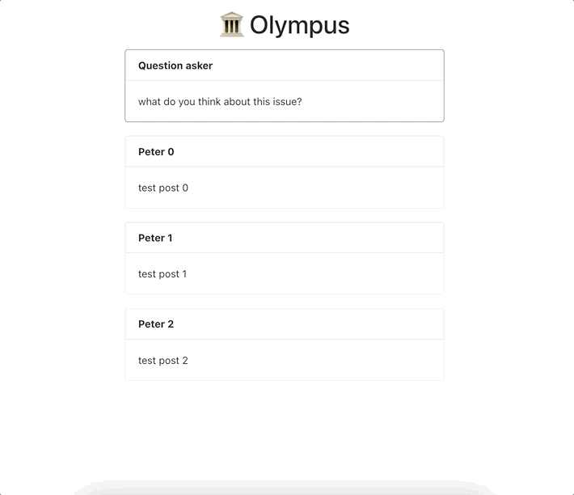

# 2-12-21 update

## Updates: Styling + Animations 
I added fade-in/fade-out and sliding animations to the posts in the linear view.

I think the animations make the post movement a lot cleaner/less jarring. They also reinforce the impermanence of the posts to the user  

I also improved the styling of the site by adding like/share counts to the posts, profile pictures, and a new navigation bar at the top. I think it's starting to feel more and more like a real social media app!

The final update I made was putting in some real names and text into the posts so we have a better idea of what the site will look like for the study.
