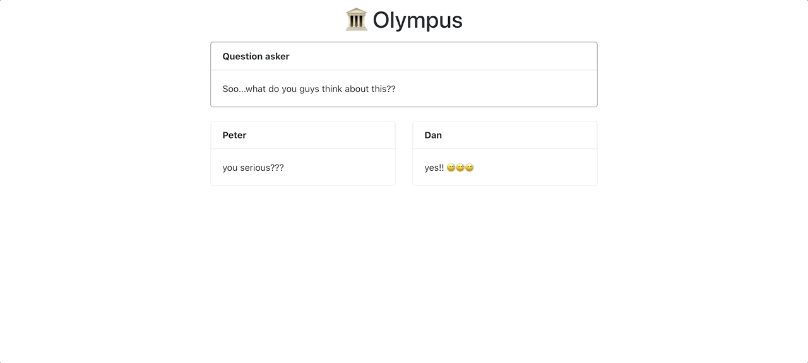

# 2-5-21 update

## Grid layout
This week I worked on the grid layout we talked about at our last meeting. I was hoping to implement a few more layouts, but this one proved pretty challenging ... there were a lot of bugs at first!

I like this view. Since the posts never move, they are easier to read. But, there are occasionally awkward gaps when a post has disappeared and a new one hasn't been added.

Also, now that posts are no longer ordered according to their time left on the page, it can be difficult to tell when a post is about to disappear. I'm thinking of adding a red border around a post when it's in the last 10 seconds of its lifecycle, but didn't have time to get to that this week.
