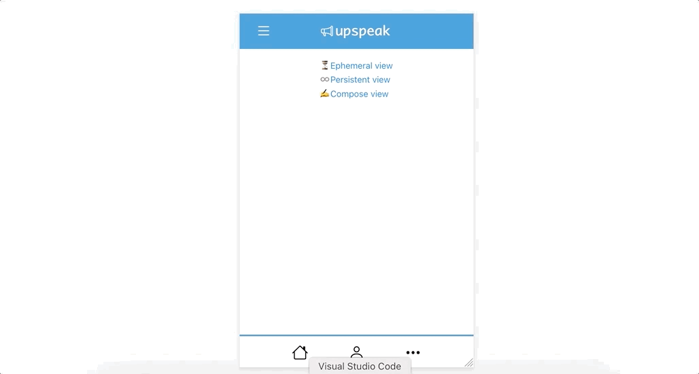
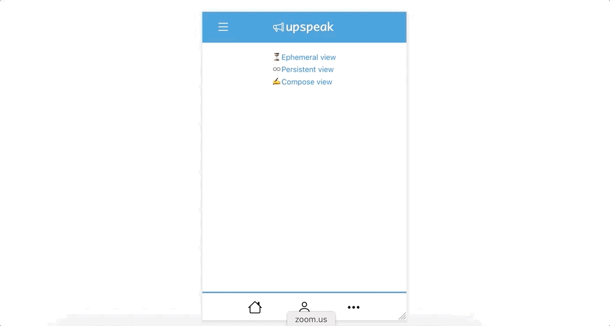

# 3-5-21 update

## Updates: styling and routes
I made all of the style changes we talked about last time, and also added routes so we can view the app in [ephemeral](https://dpil-olympus.herokuapp.com/e) vs [persistent](https://dpil-olympus.herokuapp.com/p) mode:

|Ephemeral|Persistent|
|---------|----------|
|||

I added a compose view where the participants will make posts:

The flow of the [Qualtrics survey](https://ucsb.co1.qualtrics.com/jfe/form/SV_515GtKz3cQvMN7w) will be:
1. User watches posts
2. User signs in and then makes post, which is saved by the survey

There's a weird bug where the images aren't showing up in the Qualtrics survey, I'll have to look into that ...

